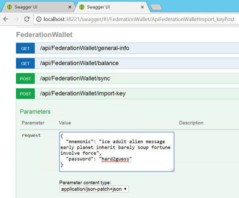
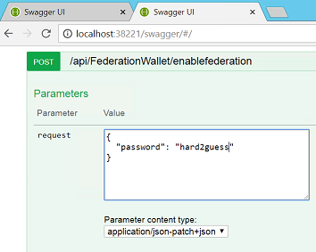

Stratis Federated Sidechains
============================
https://stratisplatform.com

## Running a sidechain gateway

In order to be a federation gateway member, you will need to be running two nodes with the _FederationGateway_ feature activated, one would be running on the mainchain network, and the other one on the sidechain network.
As a first step make sure you have prepared 2 configuration files, they should look like that, showing an port for the node's API, and a _counterchainapiport_ to connect to the node running on the other chain of the gateway, a list of IP addresses used within the federation, and a multisig redeem script (here we show a 2 of 3 multisig for instance) :

```sh
####Sidechain Federation Settings####
apiport=38226
counterchainapiport=38202
federationips=104.211.178.243,51.144.35.218,65.52.5.149
redeemscript=2 026ebcbf6bfe7ce1d957adbef8ab2b66c788656f35896a170257d6838bda70b95c 02a97b7d0fad7ea10f456311dcd496ae9293952d4c5f2ebdfc32624195fde14687 02e9d3cd0c2fa501957149ff9d21150f3901e6ece0e3fe3007f2372720c84e3ee1 3 OP_CHECKMULTISIG
publickey=02a97b7d0fad7ea10f456311dcd496ae9293952d4c5f2ebdfc32624195fde14687
# the next part is only needed when starting the federation node connected to the ApexNetwork
# it is used to specify that Federation will mine and put the reward in its Multisig wallet
mine=1
minaddress=pFmbfn5PtgsEENzBKbsDTeS5vkc52bBftL
```

Then you will have to start two deamons and connect them, here is how you can do that :

#### sidechain deamon startup 
```sh
md %AppData%\Roaming\StratisNode\apex\Test\
copy apex.gateway.conf %AppData%\Roaming\StratisNode\apex\Test\
dotnet Stratis.FederationGatewayD.dll -sidechain -conf="apex.gateway.conf"
```
#### mainchain deamon startup 
```sh
md %AppData%\Roaming\StratisNode\apex\StratisTest\
copy stratis.gateway.conf %AppData%\Roaming\StratisNode\apex\StratisTest\
dotnet Stratis.FederationGatewayD.dll -mainchain -conf="stratis.gateway.conf"
```

### Enabling the multisig wallet

1) The first time you start your federation nodes, you will have to import your private keys to build the wallet file.
This can be done via the swagger API like this:



This first step is only needed the first time you start the node. 

2) The second step is to pass in your password to enable signing the transactions with the key previously imported key.
Once again you can do this using the swagger API.



You need to pass in the same password as in the above step, which is used to encrypt you imported key.
This step will be needed everytime you restart the node

_Tip: it is important that you go through this process for the 2 nodes your federation gateway is running. The default addresses for the APIs are_
* http://localhost:38221/swagger/#/
* http://localhost:38201/swagger/#/

You should now be ready to go!