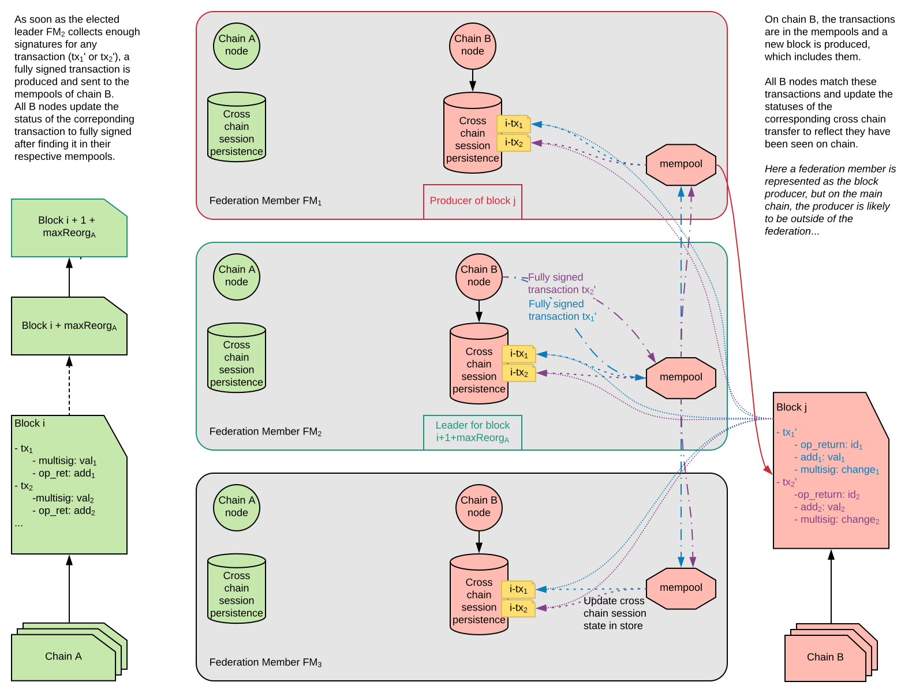
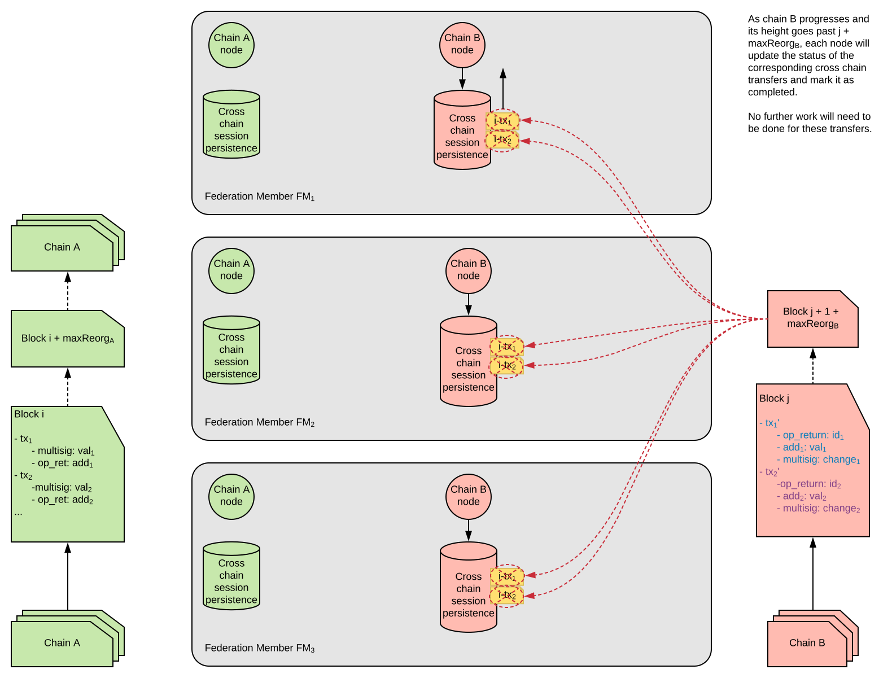
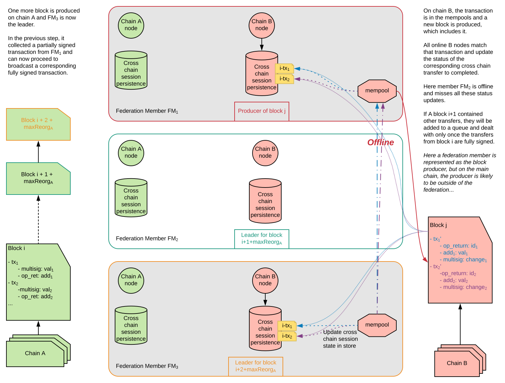

# Suggestion for Cross Chain transfers mechanism

## 1) All federation members nodes online

### A cross chain transfer is initiated

Some users of chain A decide to transfer funds to chain B. To achieve that, they each create a deposit to the multisig address of the federation on chain A. Now they will need to wait for the transfer trx to be buried under enough blocks, the maximum reorg length if activated, before the transfer mechanism of the federation is triggered.

### The cross chain transfer is triggered after chain A's maximum reorg length

When the maximum reorg length is passed and the deposit transactions cannot be reverted the federation members start to proceed with the transfer. A leader for that transfer is elected deterministically based on the block height in which the transfer transaction was confirmed on chain A, but each node still performs the same operations independently.  

Before the leader can handle the transactions in it's current block she must first look in to previous blocks and dedected if there where any unprocessed transfers, it's importnat to note that a transfer cannot happen untill all previos transfers have been processed successfully, this means a leader is also responsible for blocks belonging to other members in case they where offline.  

Each node transfers the details of the multisig deposits made on chain A (block height, target addresses and corresponding amounts to transfer), then persists those details in their database.  
From that point, each node has enough information to create partially signed transactions and propagate them to the other members of the federation. Each node will also persist the partially signed transactions they receive and collect signatures (this is in case they become the leader of an unprocessed transfer and can immedialy broadcast it), but only the leader will proceed to broadcasting a fully signed one.

### The cross chain transfer appears on targeted chain

Once the leader has collected enough signatures, she can broadcast a fully signed transaction to the network and make it appear in the mempool of all the other nodes. This transaction will then be persisted in the next block of chain B network.  
After that, each federation member monitoring the chain B will match the transaction found on chain by its inputs, outputs (including the OP_RETURN), and update the status of the transfer.

### The cross chain transfer passes chain B's maximum reorg length

Finally, as chain B progresses and the transfer's maturity passes the maximum reorg length, all federation nodes monitoring the B chain can update the status of the corresponding session in their respectives stores. Once the status of the session is marked complete, no more work will be required for this session.

## 2) Preferred leader offline

### A cross chain transfer is triggered while leader is offline

Similar to the previous case, deposit transactions to the federation's multisig on chain A have triggered a cross chain transfer. Here however, the prefered leader happens to be offline. All other nodes carry on as usual, creating and exchanging partially signed transactions. However, no one is here to broadcast it as FM2 is offline.

### The cross chain is handled one block later by next leader

As time passes, a new block appears on chain A, and a new leader is elected (FM3). This new leader can now broadcast the transaction and we are back on the normal path (cf 1.).  

As described earlier every new leader must first check for previously unprocessed transfer and processes those first before attending to the transfers on current block, if a few leaders are offline this can create a backlog of transfers.  
If a leader finds a previously unprocessed transfer and they dont have enough signatures to broadcst they must do nothing and wait for the other members to send over signatures.  
If not enough members are online as the minimum required to fulfill the multisig then transfers will halt untill enough members come onine and broadcast signatures. 

### The leader comes back online

When the leader comes back online, it will retrieve from its stores what was the last known block heights for which it had dealt with, and resync its store from there while synching up its nodes. Partial transactions will then be added to the store and updated (or potentially completed) depending on their status on the chain B.  
The node will only be able to participate in cross chain transfers when it is fully synced again, and has the correct view of the multisig utxos set.  

A leader that is now synced and observes there are unprocessed previous transfers will start to create signatures for those transfers and broadcast them to the other federation members.

## 3) Building the chain B transaction deterministically

There are two main reasons for building transactions deterministically.
1. To allow for each member to independently build the exact same transaction, then the federation members will never need to sign a UTXO more then once this is for security reasons.
2. To simplify the processes of sharing signaturs (a none determininstic approach means a leader needs to create a session for the transfer and coordinate with peers to sign it).  

Assuming members are synced and have the same view of the multisig address (the collection of UTXOs) then using a predefined algorithem every member can generate the transfer transaction, sign with their key and broadcast to the other members (possibly its enought to only broadcast to the current leader).  
It may be that in order to use a multisig UTXO the algorithem will require it to be burried under enough blocks, to avoid reorgs and that we can be sure that all member have the same view of the UTXO list.

**The algorithem to select UTXOs:**
- The oldest UTXO first
- If a block has more then one UTXO then first one in the list is first
- Outputs are sorted but destination address
- Change address (back to multisi) is any is last.
- OP_RETURN of block hash of chain the transfar came from.

A member that comes back online after a long perioud will need to sync both chains and also build the databse of transfer transactions, this they should be able to just by looking at the chains themselvs.  
A memebr that came online will, when is synced with chains, check all the unporcessed transfers and start signing unporcessed transfers and broadcast them to peers, at this poiint they have the correct view of the multisig UTXO list. 

**The algorithem to select the leader:**

TODO:

## Considerations ## 

- What is the fee going to be on the transfer trx (to maintain determinizem)
- What if a block is full of transfer transactions (too full for the other chain)
- What if all members are offline how do we handle resync of federation members

What can cause a member to generate a multisig that is different for the rest of the federation (break determinisem)

