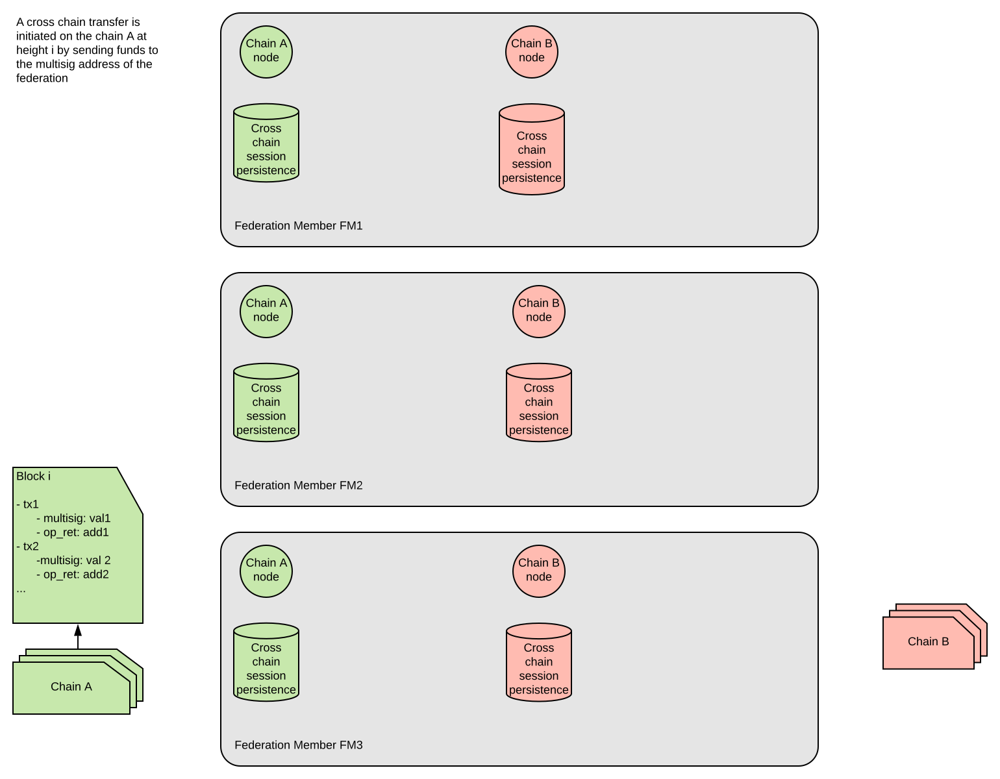
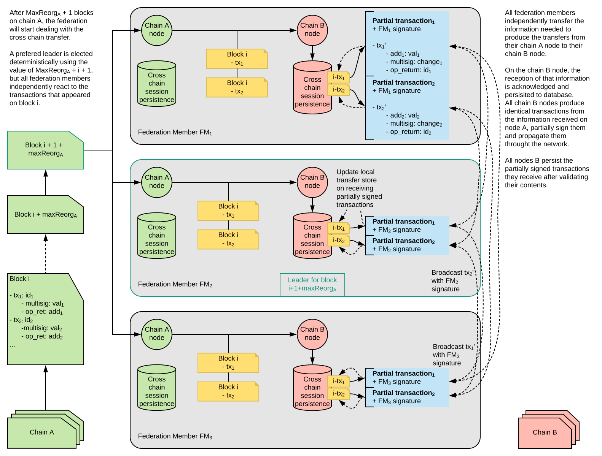
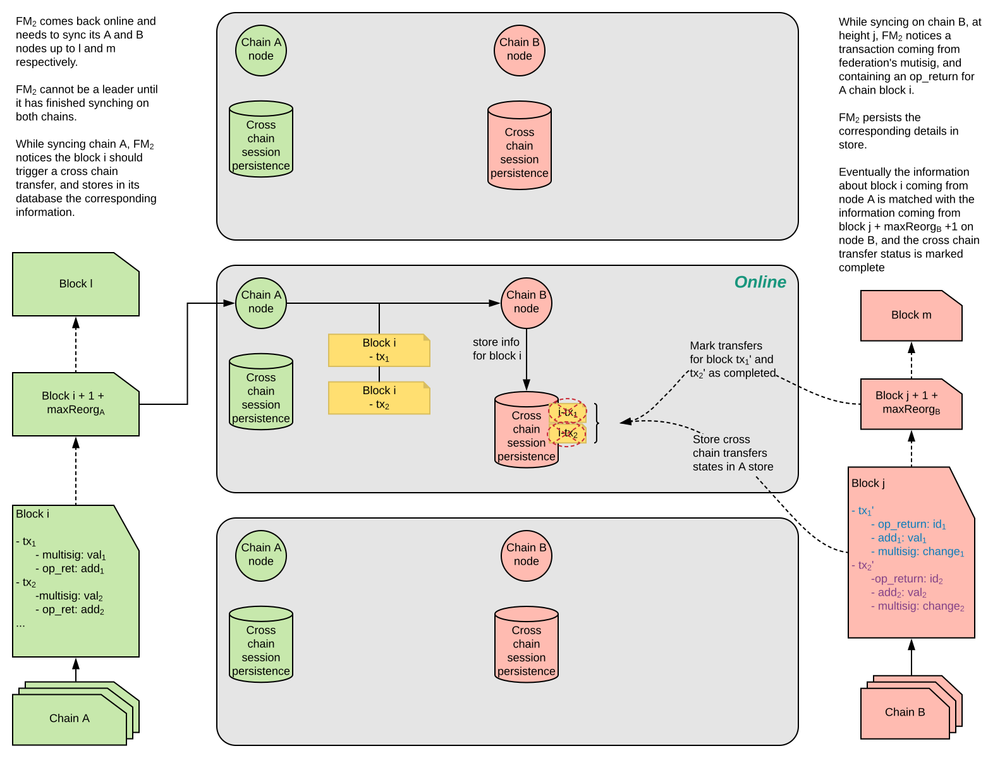
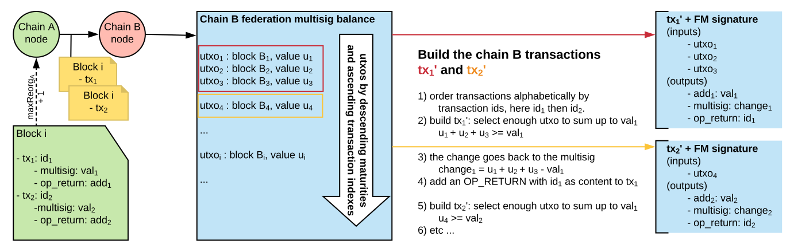

# Suggestion for Cross Chain transfers mechanism

## 1) All federation members nodes online

### A cross chain transfer is initiated

Some users of the chain A decide to transfer funds to the chain B. To achieve that, they create 2 deposits to the multisig address of the federation on chain A. Now they will need to wait for as many blocks as the maximum reorg length before the transfer mechanism triggers.

### The cross chain transfer is triggered after maximum reorg length

As the maximum reorg length is passed, and the deposit transactions cannot be reverted, the federation starts to proceed with the transfer. A prefered leader for that transfer is elected deterministically based on the current heighty of chain A, but wach node still performs the same operations independently.

### The cross chain transfer appears on targeted chain

Once the leader has collected enough signatures, he can broadcast a fully signed transaction to the mempool and all the other nodes should get it. This transaction will then be persisted in the next block by another node in the chain B network.

## 2) Preferred leader offline

### A cross chain transfer is triggered while leader is offline

Similar to the previous case, deposit transactions to the federation's multisig on chain A have triggered a cross chain transfer. Here however, the prefered leader happens to be offline. All other nodes carry on as usual, creating and exchanging partially signed transactions. However, no one is here to broadcast it as FM2 is offline.

### The cross chain is handled one block later by next leader

As time passes, a new block appears on chain A, and a new leader is elected (FM3). This new leader can now broadcast the transaction and we are back on the normal path (cf 1.).

### The leader comes back online

When the leader comes back online, it will retrieve from its stores what was the last known block heights for which it had dealt with transfers, and resync its store from there while synching up its nodes. Partial transactions will then be added and removed from the store depending on there status on the chain B.

## 3) Building the chain B transaction deterministically

